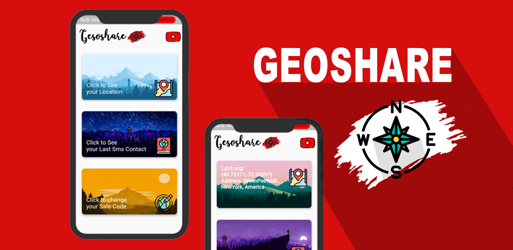
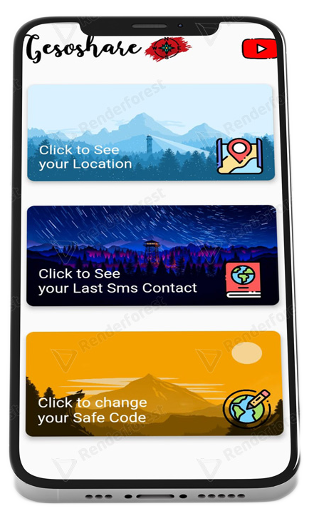

# Geoshare App Ver 1.0.0

Best way to locate someone

## How the App works?

This app will require the use of location to function properly.
This app can help you locate a person with just a simple SMS. The SMS will contain a safe code that only you the person with the app and the people you share it will know. You will send the message containing the code and get back the current address and coordinates of the person. This app is useful if you want to keep track of someone close to you and keep them safe. This app sends the location without the use of WIFI.

  

## Download

| Android apk|
|:--------|
|[Geoshare-apk ver 1.0.0](https://github.com/Hamas-ur-Rehman/Geoshare-App/raw/master/Downloads/app-release.apk)|

## Youtube Tutorial

<a href= "https://youtu.be/P5RbStBbyKk"><a>
